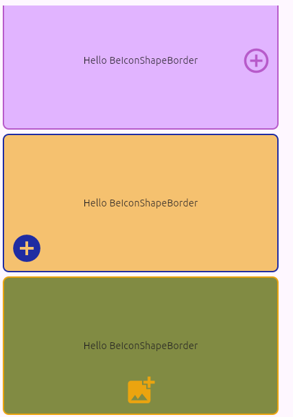
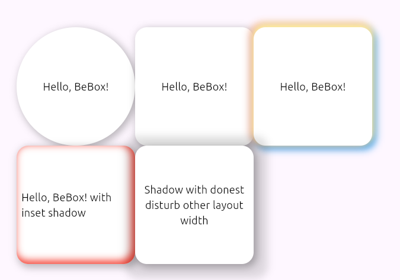

<<<<<<< HEAD
=======
## Showcase

Below are some visual showcases of the widgets in action:

<p align="center">
  
  
  
  
  
  
  
  
  
  
  
  

</p>

>>>>>>> upstream/main
## Example Usage

Below are example code snippets for the main widgets and utilities:

### BeBadge

```dart
BeBadge(
  child: Icon(Icons.notifications),
  badge: Text('3'),
  position: BeBadgePosition.topRight,
  rounded: true,
  offset: Offset(4, 4),
)
```

### BeLabel

```dart
BeLabel(
  child: Icon(Icons.info),
  label: Text('New'),
  position: BeLabelPosition.topLeft,
  offset: Offset(8, 0),
)
```

### BeMultiBadge

```dart
BeMultiBadge(
  child: Icon(Icons.shopping_cart),
  labels: [
    BeBadgeChild(position: BeMultiBadgePosition.topRight, badge: Text('Sale')),
    BeBadgeChild(position: BeMultiBadgePosition.bottomLeft, badge: Text('New')),
  ],
)
```

### BeMultiLabel

```dart
BeMultiLabel(
  child: Icon(Icons.person),
  labels: [
    BeLabelChild(position: BeMultiLabelPosition.topRight, label: Text('VIP')),
    BeLabelChild(position: BeMultiLabelPosition.bottomLeft, label: Text('Active')),
  ],
)
```

### BeRow & BeColumn

```dart
BeRow(
  spacing: 12,
  children: [
    BeColumn(xs: 6, child: Text('Left')),
    BeColumn(xs: 6, child: Text('Right')),
  ],
)
```

### BeOffset

```dart
BeOffset(
  offset: Offset(20, 10),
  child: Icon(Icons.star),
)
```

### BeBoxDecoration

```dart
Container(
  width: 100,
  height: 100,
  decoration: BeBoxDecoration(
    color: Colors.blue,
    borderRadius: BorderRadius.circular(8),
    boxShadow: [
      BeBoxShadow(color: Colors.black26, blurRadius: 8, inset: true),
    ],
  ),
)
```

### BeIconShapeBorder

```dart
Container(
  width: 80,
  height: 80,
  decoration: ShapeDecoration(
    shape: BeIconShapeBorder(
      icon: Icons.check,
      color: Colors.green,
      radius: 12,
      width: 2,
      alignment: BeIconAlignment.center,
    ),
  ),
)
```

<!--
This README describes the package. If you publish this package to pub.dev,
this README's contents appear on the landing page for your package.

For information about how to write a good package README, see the guide for
[writing package pages](https://dart.dev/guides/libraries/writing-package-pages).

For general information about developing packages, see the Dart guide for
[creating packages](https://dart.dev/guides/libraries/create-library-packages)
and the Flutter guide for
[developing packages and plugins](https://flutter.dev/developing-packages).
-->

# `be_widgets` Flutter Package

## Overview

`be_widgets` is a collection of advanced, composable Flutter widgets for building beautiful, responsive, and interactive UIs. It includes layout primitives, decoration helpers, and overlay widgets for badges and labels.

## Features

- Responsive row/column layouts (BeRow, BeColumn)
- Overlay badges and labels (BeBadge, BeLabel, BeMultiBadge, BeMultiLabel)
- Custom offset and positioning (BeOffset)
- Advanced decoration and shape borders (BeBoxDecoration, BeIconShapeBorder)
- Dashboard playground for live widget experimentation
- Easy integration and extensive customization

## Main Exports

Below are the main exports provided by the package:

- **be_badge.dart**: BeBadge widget for overlaying badges on other widgets with customizable position and style.
- **be_breakpoint.dart**: Utilities for responsive breakpoints, enabling adaptive layouts based on screen size.
- **be_column.dart**: BeColumn widget for responsive column layouts, similar to Bootstrap's grid system.
- **be_container.dart**: BeContainer widget for flexible container layouts with additional styling options.
- **be_label.dart**: BeLabel widget for overlaying labels on other widgets with customizable position and appearance.
- **be_multi_badge.dart**: BeMultiBadge widget for displaying multiple badges on a single widget, each with independent positioning.
- **be_multi_label.dart**: BeMultiLabel widget for displaying multiple labels on a single widget, each with independent positioning.
- **be_offset.dart**: BeOffset widget for offsetting child widgets without using a Stack.
- **be_row.dart**: BeRow widget for responsive row layouts, supporting spacing, alignment, and breakpoints.
- **be_size_aware.dart**: Utilities and widgets for size awareness and adaptive rendering.
- **be_text_more.dart**: BeTextMore widget for expandable/collapsible text with “show more/less” functionality.
- **be_wrap.dart**: BeWrap widget for wrapping children with responsive spacing and alignment.
- **decoration/be_box_decoration.dart**: BeBoxDecoration for advanced box decoration, including custom shadows and interpolation.
- **decoration/be_box_shadow.dart**: BeBoxShadow for enhanced shadow effects, including inset and outset support.
- **decoration/be_icon_shape_border.dart**: BeIconShapeBorder for drawing icons inside custom shape borders.

## Playground & Usage Example

Try the interactive dashboard playground in `example/lib/usecase/use_case_be_row.dart` to experiment with BeRow layouts, card content, and responsive previews:

```dart
BeRow(
  spacing: 16,
  runSpacing: 8,
  mainAxisAlignment: MainAxisAlignment.start,
  crossAxisAlignment: CrossAxisAlignment.start,
  mainAxisSize: MainAxisSize.max,
  padding: EdgeInsets.all(8),
  debugGrid: false,
  children: [
    BeColumn(
      xs: 12, sm: 6, lg: 3,
      child: Card(
        child: Padding(
          padding: EdgeInsets.all(16),
          child: Column(
            children: [
              Icon(Icons.people, color: Colors.blue),
              Text('Users'),
              Text('12.5K'),
            ],
          ),
        ),
      ),
    ),
    // Add more BeColumn cards...
  ],
)
```

### Dashboard Playground Instructions

- Open the playground in Widgetbook or your app.
- Use knobs to adjust:
  - Number of cards
  - Card titles, values, icons, colors
  - Row/column spacing, alignment, padding
  - Preview mode (Desktop/Mobile)
- Instantly see layout changes and responsiveness.

---

## Screenshots






## Getting Started

Add to your `pubspec.yaml`:

```yaml
dependencies:
  be_widgets: ^<latest_version>
```

Then, run:

```bash
flutter pub get
```

Import in your Dart code:

```dart
import 'package:be_widgets/be_widgets.dart';
```

Now you can use all widgets in your Flutter app!

Contribution and Issues
If you encounter any issues or would like to contribute to the be_widget package, feel free to visit the GitHub repository: be_widget on GitHub

License
This package is released under the MIT License. See the LICENSE file for details.

## BeLabel

`BeLabel` is a custom Flutter widget that renders a label on another widget. It is designed to be versatile, allowing you to position the label based on different configurations.

Attributes

child: The primary `widget` on which the label will be rendered.

label: The `label` widget to be displayed. If not provided, an empty-sized SizedBox will be used.

position: An enumeration representing the position of the label. It includes options such as ` topLeft`, `topCenter`, `topRight`, `rightTop`, `rightCenter`, `rightBottom`, `bottomRight`, `bottomCenter`, `bottomLeft`, `leftBottom`, `leftCenter`, `leftTop`, and `center `.

offset: An `offset` representing the translation of the label from its default position.

childSized: A `boolean` indicating whether the label's size should match the size of the child widget.

innerLabel: A `boolean` indicating whether the label should be positioned inside the child widget.

```dart

    BeLabel(
      child: YourWidget(),
      label: YourLabelWidget(),
      position: BeLabelPosition.topLeft,
      offset: Offset(10.0, 5.0),
      childSized: false,
      innerLabel: false,
    );

```

## BeBadge Widget

`BeBadge` is a custom Flutter widget that renders a badge on another widget. It is designed to be versatile, allowing you to position the badge based on different configurations.

Attributes

`child`: The primary widget on which the badge will be rendered.

`badge`: The badge widget to be displayed. If not provided, an empty-sized SizedBox will be used.

`position`: An enumeration representing the position of the badge. It includes options such as topLeft, topCenter, topRight, centerLeft, center, centerRight, bottomLeft, bottomCenter, and bottomRight.

`rounded`: A boolean indicating whether the badge should have rounded corners.

`offset`: An offset representing the translation of the badge from its default position.

Usage

```dart
    BeBadge(
      child: YourWidget(),
      badge: YourBadgeWidget(),
      position: BeBadgePosition.topRight,
      rounded: false,
      offset: Offset(10.0, 5.0),
    );
```

Note
If badge is not provided, an empty SizedBox will be used as a placeholder.

The position attribute determines the position of the badge relative to the child widget.

The rounded attribute can be set to true to give the badge rounded corners.

The offset attribute allows you to translate the badge from its default position.

Feel free to customize the widget according to your needs.

## BeMultiBadge

`BeMultiBadge` Flutter Widget
BeMultiBadge is a custom Flutter widget designed for rendering multiple badges on another widget. It provides flexibility in positioning badges based on different configurations.

Attributes
`child`: The primary widget on which the badges will be rendered.

`labels`: A list of BeBadgeChild objects representing the badges to be displayed.

`rounded`: A boolean indicating whether the badges should have rounded corners.

Usage

```dart
    BeMultiBadge(
      child: YourWidget(),
      labels: [
        BeBadgeChild(position: BeMultiBadgePosition.topRight),
        BeBadgeChild(position: BeMultiBadgePosition.bottomLeft, offset: Offset(5.0, 10.0)),
        // Add more badges as needed
      ],
      rounded: false,
    );
```

Note
The labels attribute is a list of BeBadgeChild objects, each representing a badge. You can customize the position and offset of each badge individually.

The rounded attribute can be set to true to give all badges rounded corners.

Feel free to customize the widget according to your needs.

## BeMultiLabel Widget

BeMultiLabel is a custom Flutter widget designed for rendering multiple labels on another widget. It provides flexibility in positioning labels based on different configurations.

Attributes
`child`: The primary widget on which the labels will be rendered.

`labels`: A list of BeLabelChild objects representing the labels to be displayed.

Usage

```dart
    BeMultiLabel(
      child: YourWidget(),
      labels: [
        BeLabelChild(position: BeMultiLabelPosition.topRight),
        BeLabelChild(position: BeMultiLabelPosition.bottomLeft, offset: Offset(5.0, 10.0)),
        // Add more labels as needed
      ],
    );
```

Note
The labels attribute is a list of BeLabelChild objects, each representing a label. You can customize the position and offset of each label individually.

# BeBoxDecoration & BeIconShapeBorder

This package provides two custom Flutter components:

1. `BeBoxDecoration`: An extension of `BoxDecoration` with added support for custom shadows (`BeBoxShadow`) and better interpolation.
2. `BeIconShapeBorder`: A custom `OutlinedBorder` that displays an icon inside a bordered shape with flexible alignment.

## BeBoxDecoration


### Features

- Custom shadow support (`BeBoxShadow` with inset/outset capabilities).
- Extended `copyWith`, `lerp`, and `scale` methods for enhanced flexibility.
- Maintains compatibility with Flutter’s decoration system.

### Example Usage

```dart
Container(
  width: 150,
  height: 150,
  decoration: BeBoxDecoration(
    color: Colors.blue,
    borderRadius: BorderRadius.circular(12),
    boxShadow: [
      BeBoxShadow(
        color: Colors.black26,
        blurRadius: 10,
        spreadRadius: 2,
      ),
    ],
  ),
  child: Center(
    child: Text(
      "BeBoxDecoration",
      style: TextStyle(color: Colors.white),
    ),
  ),
)
```

---

## BeIconShapeBorder

### Features

- Allows an icon to be drawn within a shape border.
- Supports customizable border radius, color, width, and icon alignment.
- Works seamlessly with `ShapeDecoration`.

### Example Usage

```dart
Center(
  child: Container(
    width: 100,
    height: 100,
    decoration: ShapeDecoration(
      shape: BeIconShapeBorder(
        icon: Icons.import_contacts_sharp,
        size: 24,
        color: Colors.red,
        radius: 8,
        width: 2,
        alignment: BeIconAlignment.bottomRight,
        offset: Offset(-10, 10),
      ),
    ),
    child: Center(
      child: Text("Hello", style: TextStyle(color: Colors.green)),
    ),
  ),
)
```

All components offer extensive customization for creating beautiful UI elements in Flutter!

Feel free to customize the widget according to your needs.

### Contribution and Issues

If you encounter any issues or would like to contribute to the be_widget package, feel free to visit the GitHub repository: be_widget on GitHub [https://github.com/BusinessOcean/be_widgets]

### License

This package is released under the MIT License. See the LICENSE file for details.

Do What ever you want with this package like.

Happy coding with be_widget!

# Support My Work

Thank you for checking out our project! We're thrilled to have you here.

If you find our project useful and it has helped you in any way, please consider supporting our work. Your contribution will help us continue to improve this project and create more useful tools for the community.

## How You Can Help

### Donate

If you'd like to contribute financially, you can make a donation to our project. Even a small amount can make a big difference and will be greatly appreciated.

[](https://www.paypal.me/SouravKumarPandit)

### Spread the Word

Help us reach more people by sharing our project with your friends, colleagues, and on social media. The more visibility we get, the more support we can receive.

### Contribute

If you're a developer, you can contribute to the project by submitting bug reports, feature requests, or even code contributions. Check out our [Contribution Guidelines](CONTRIBUTING.md) to get started.

## Get in Touch

We'd love to hear from you! If you have any questions, feedback, or suggestions, please don't hesitate to reach out to us.

- Email: [businessocean.pvt.ltd@gmail.com](mailto:businessocean.pvt.ltd@gmail.com)
- Twitter: [@soupandit](https://twitter.com/soupandit)

Thank you for your support!
